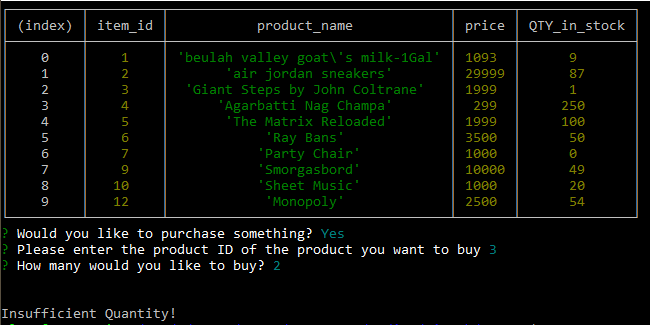
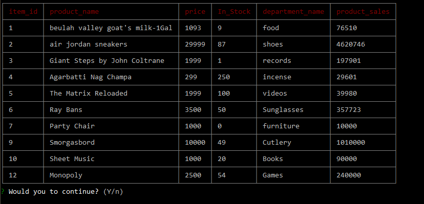
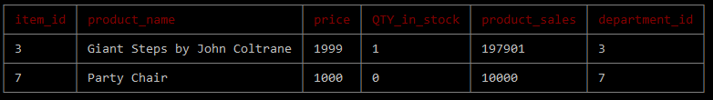
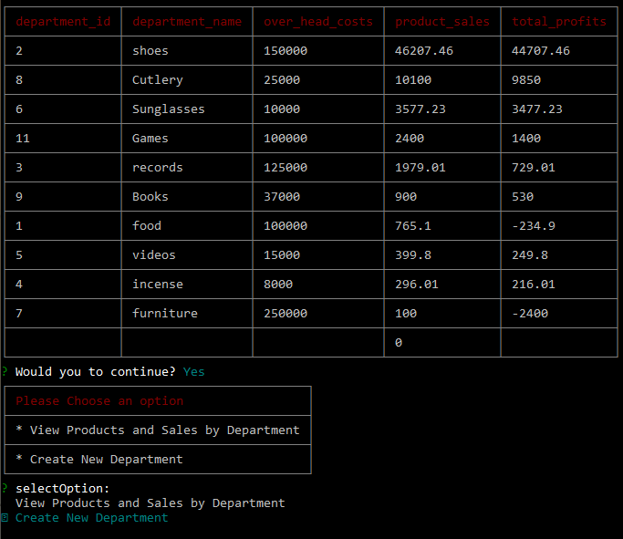

# O-Zone
The Online Outlet Zone is an online store. This project uses Node.js and MySQL.

This application is a suite of three files, each of which is meant to be run separately for different functions, as defined in the requirements.

To use this suite, first clone the repository. Then, install node package dependencies by running invoking `npm install` from the command line.

You will also need to set up a database and seed it by running the sql script in the /DBseeds/ folder.

After the repo has been cloned and the npm packages installed, you can run any of the following three nodejs files to interact with the database.

1. ozoneCustomer.js: invoke `node ozoneCustomer.js` from the command line.
2. ozoneManager.js: invoke `node ozoneManager.js` from the command line.
3. ozoneSupervisor.js: invoke `node ozoneSupervisor.js` from the command line.

## ozoneCustomer.js

To run ozoneCustomer.js, invoke `node ozoneCustomer.js` from the command line.

The first thing you will see will be, a list of products available for sale, along with their item IDs, their prices, their names and how many are in stock.

You will be asked if you would like to purchase anything. Press the 'y' key for yes or any other key to exit, and press enter.

You will be asked to enter the ID number of the item you would like to purchase.

To purchase a product, enter the item_id value for that product, and press enter.

You will be asked what quantity you would like to purchase of that item. Enter a quantity and press enter.

So long as the number you enter for quantity to purchase is not greater than the number in stock, the purchase will execute and the value of quantity in stock will be reduced accordingly.

If you enter a number that is greater than the quantity in stock, you will be given the "Insufficient Quantity" message.

Whether your purchase is executed or not, the program execution will be completed at this time.

## ozoneManager.js

To run ozoneManager.js, invoke `node ozoneManager.js` from the command line. You will be greeted by a menu of four options.

Select "View Products" to a see a list of products in stock. 

If you enter "y" after this, you will again be presented with the menu, allowing you to make another selection.

To see items with quantity in stock below 5, select "View Low Inventory."

To add an item to inventory, select that option, then select the desired item you are restocking, and enter in the new number for quantity in stock.

to add a product, select that option and enter in the product information.

## ozoneCustomer.js

To run ozoneCustomer.js, invoke `node ozoneCustomer.js` from the command line. You will be presented with a menu of two options.

To see product sales by department, select that option.

To create a new department, select that option and enter in the requested information.

